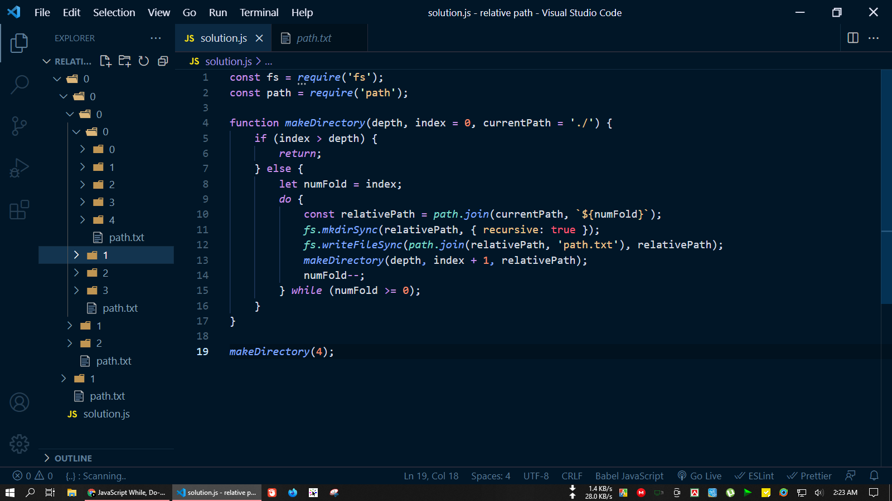
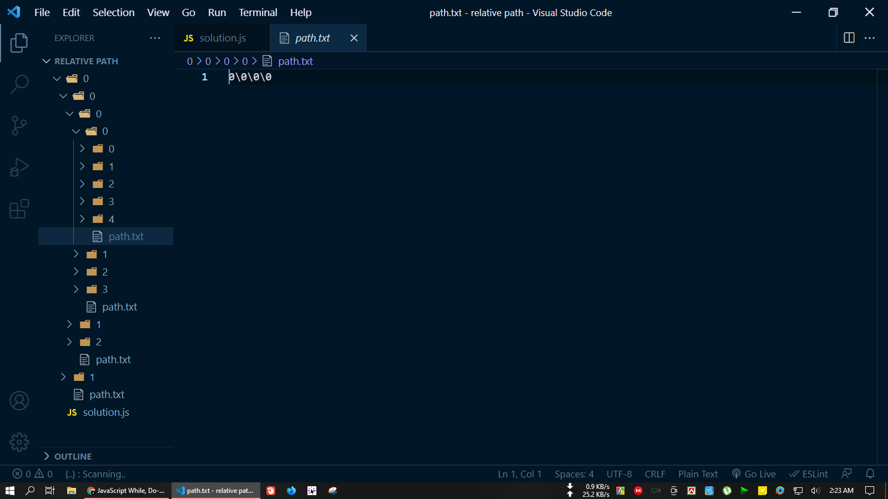

## create-directory-and-path :grinning:

### The problem is:

### Write a script (in any language) that accepts a single parameter (depth) to create the expected folders and files:

  
- At depth 0, create a folder named 0, and create a file in it with its relative path as the content.
 
- At depth 1: besides what should be done with depth 0, create two subfolders named 0 and 1 and create a file to save its path in both respectively.
 
- At depth 2: besides what should be done at depth 1, create subfolders in folders created at depth 1, and name them as 0, 1 and 2, and create files following the same rule. 
 
- At depth N: Same rules.

##### The problem is solved in the code and the results are shown as a sample below: (I have done this with JavaScript for logic and Node.js for folder and file creating)

